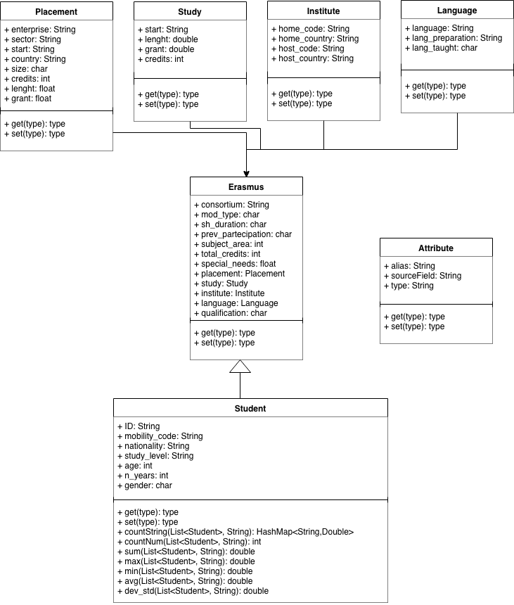
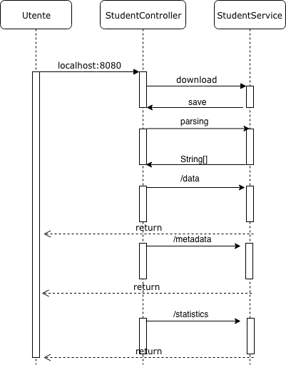
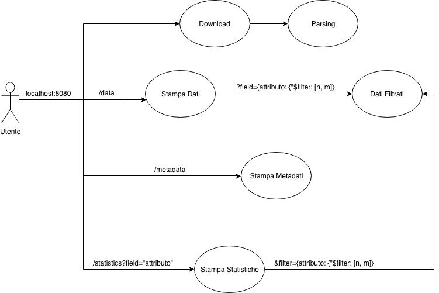

# projoggetti
<body>

Il dataset assegnatoci contiene collegamenti a più file dello stesso argomento - dati sui partecipanti e gli organizzatori di un percorso Erasmus -, della quale tre sono di estensione <i>.csv</i>. La scelta è ricaduta sul file con più righe (il CSV completo presenta quasi 300 000 record, per le stampe e le statistiche abbiamo fatto in modo di visualizzarne solo i primi 1000 per velocizzare ed alleggerire le interrogazioni sul file).

Per organizzare i dati abbiamo modellato più classi, della quale una astratta. Ognuna di queste racchiude gli attributi dei record che sono stati divisi a seconda del concetto rappresentato (com'è descritto dal seguente diagramma delle classi).
</img>

Tutte saranno istanza della superclasse <b>Student</b>. Tutte queste classi si troveranno nel package <b>model</b>.

Di seguito riportiamo il diagramma delle sequenze che ha lo scopo di rappresentare l'esecuzione del programma.

</img>

E successivamente si trovano i casi d'uso dell'applicazione.

</img>
  <h3>/data</h3>

La prima rotta è <i>/data</i> che stampa tutti gli attributti in coppia nome valore, separati per classe d'implementazione.

Prima di tutto salviamo i dati in un ArrayList <b>List<Student></b>, inizializzato nel Service all'interno della quale si definisce anche il metodo <b>retrieveAllData</b> e <b>retrieveDataStudent</b> che vengono richiamati dal Controller e servono a prendere le informazioni che vogliamo stampare

Si possono applicare a <i>/data</i> dei filtri, con la sittassi <b>/data?filter=</b>. Sono stati implementati filtri con operatori sia condizionali che logici e sono specificati di seguito. Questo è possibile perchè è stato specificato un @RequestParam con valore di default nullo.

  <h3>/metadata</h3>

  <h3>/statistics</h3>

</body>

localhost:8080/data?filter={"age":{"$not":21}} 
localhost:8080/data?filter={"sh_duration":{"$in":["T","?"]}} 
localhost:8080/data?filter={"studygrant":{"$nin":[0, 1235, 355.84]}} 
localhost:8080/data?filter={"$or":[{"lang_preparation":"EC"},{"lang_preparation":"NN"}]} 
localhost:8080/data?filter={"$or":[{"lang_preparation":"EC"},{"total_credits":30}]} 
localhost:8080/data?filter={"$and":[{"gender":"M"},{"age":21}]} 
localhost:8080/data?filter={"studylength":{"$gt":4}} 
localhost:8080/data?filter={"studycredits":{"$gte":48}} 
localhost:8080/data?filter={"n_years":{"$lt":3}} 
localhost:8080/data?filter={"subject_area":{"$lte":22}} 
localhost:8080/data?filter={"placementgrant":{"$bt":[800,900]}} 

localhost:8080/statistics?field=study_level&filter={"host_code":{"$not":"IT"}} 
localhost:8080/statistics?field=age&filter={"placemententerprise":{"$in":["STUDIO ROMOLI","UNIVERSIT? DI ROMA"]}} 
localhost:8080/statistics?field=gender&filter={"placementcountry":{"$nin":["???","IT"]}} 
localhost:8080/statistics?field=placementsector&filter={"$or":[{"gender":"M"},{"placementstart":"Apr-13"}]} 
localhost:8080/statistics?field=placementsector&filter={"$or":[{"placementstart":"Mar-13"},{"placementstart":"Apr-13"}]} 
localhost:8080/statistics?field=mob_type&filter={"$and":[{"host_country":"FI"},{"study_level":1}]} 
localhost:8080/statistics?field=n_years&filter={"total_credits":{"$gt":30}} 
localhost:8080/statistics?field=total_credits&filter={"n_years":{"$gte":2}} 
localhost:8080/statistics?field=Gender&filter={"age":{"$lt":25}} 
localhost:8080/statistics?field=studylength&filter={"subject_area":{"$lte":38}} 
localhost:8080/statistics?field=lang_taught&filter={"age":{"$bt":[20,30]}} 

